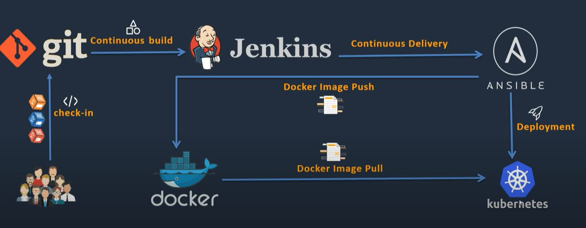

# Devops_Capstone_Project
## Ahmed M. Hasan
## Udacity DevOps Nanodegree

## Introduction
In this project we'll apply the skills and knowledge which were developed throughout the Cloud DevOps Nanodegree program.
These include:
* Working in AWS
* Using Jenkins to implement Continuous Integration and Continuous Deployment
* Building pipelines
* Working with Ansible and CloudFormation to deploy clusters
* Building Kubernetes clusters
* Building Docker containers in pipelines

## Proposed Pipeline

## Prerequisites
* AWS Account
* GitHub Account
* Docker ID

## Used Tools
* AWS EC2 instance
* Git
* Java
* Python
* Jenkins
* Docker
* AWS CLI
* Ansible
* AWS Elastic Kubernetes Service
